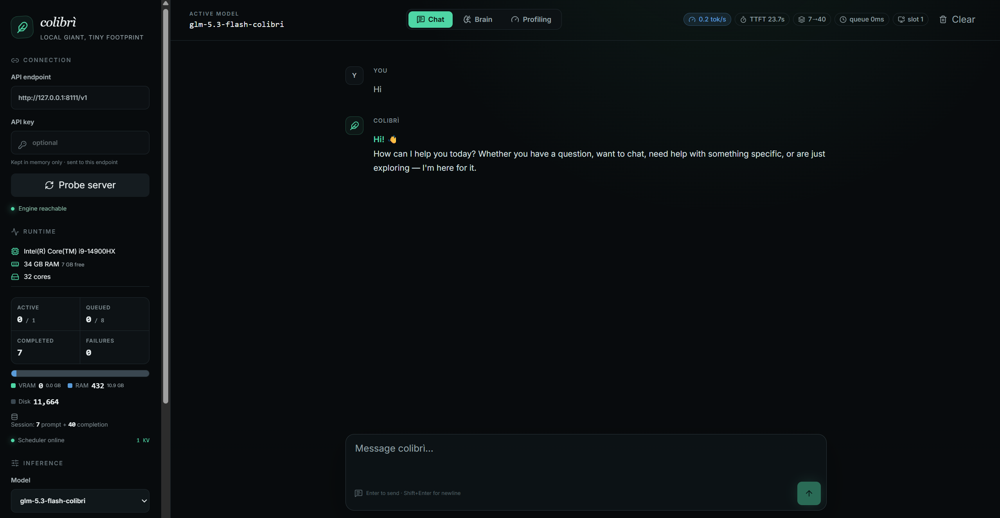
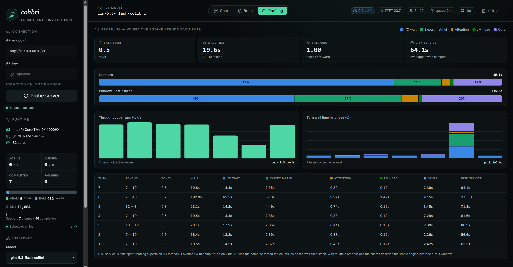
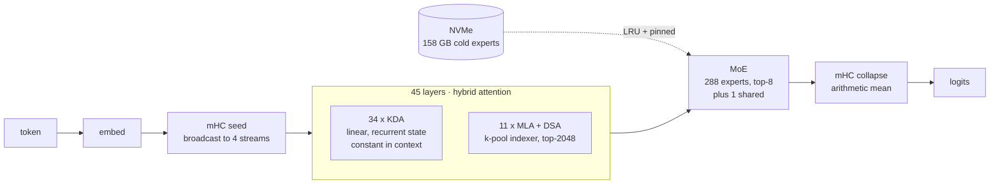

<div align="center">



<br>

**Run [GLM-5.3-Flash](https://huggingface.co/zai-org/GLM-5.3-Flash) — 320B total / 18B active — on a consumer laptop, by streaming experts from NVMe.**

<br>


</div>

---

This adds a GLM-5.3 engine to [colibri](https://github.com/JustVugg/colibri), which supports
GLM-5.2 but not GLM-5.3. It is a **fork with additions**, not a new engine — see
[NOTICE](NOTICE) for exactly what is derived and from what.

> [!IMPORTANT]
> **Running on the complete 320B checkpoint.** Converted from the full 328 GB release —
> 38,770 tensors, none missing — and generating coherent, instruction-following text on the
> real weights, single-turn and multi-turn. Every component is additionally checked against an
> independent oracle.
>
> What does not exist *anywhere* is a **reference implementation** to diff against end to end:
> GLM-5.3 has no entry in `transformers`, and no public implementation of its `eh_proj` head.
> So the assembled model is verified component by component and by its own output rather than
> against a golden reference. [docs/VALIDATION.md](docs/VALIDATION.md) sets out exactly what
> that does and does not cover.

---

## See it running

<div align="center">



<sub><b>320B answering on a laptop.</b> 34 GB RAM, experts streamed from NVMe.
7 requests completed, 0 failures. (Captured before the tuning work below took it to 0.76 tok/s.)</sub>

<br><br>



<sub><b>Where every turn actually goes.</b> <b>73%</b> of this turn was I/O wait — which looked
like a disk bottleneck but was really a latency one: the drive was only 15% busy. See Performance.</sub>

</div>

### Multimodal

```
black frame                 -> "The image is completely black with no visible content."
white frame                 -> "The image is completely blank and white."
red circle, top-left        -> "The red circle is in the top-left corner."
red circle, bottom-right    -> "The red circle is in the bottom-right corner."
```

The last two matter more than they look: the same question over a flipped image, giving
different and correct answers. An earlier build answered "top-left" to both — passing the
first test by luck while being completely blind. 285 prompt tokens (256 image + 29 text).

---

## Why this needed writing

GLM-5.3 is not GLM-5.2 with different weights. Five things differ enough to break the
existing engine:

| | GLM-5.2 | GLM-5.3-Flash |
|---|---|---|
| Attention | 100% MLA | **34 KDA (linear) + 11 MLA/DSA** of 45 |
| Residual | single stream | **mHC** — 4 parallel streams, Sinkhorn mixing |
| DSA indexer | per-token scoring | **k-pool** — scores pools of 4 tokens |
| Activation | plain SwiGLU | **clamped** SwiGLU (`swiglu_limit: 10.0`) |
| Tensor names | `model.layers.N` | `model.language_model.layers.N` |

Two pieces already existed inside colibri and were reused: **KDA** from its Kimi K3 engine,
**mHC** verbatim from its DeepSeek-V4 engine. (llama.cpp's `glm5next` PR independently reached
the same two donors.) The k-pool indexer existed nowhere runnable.

<details>
<summary><b>Architecture at a glance</b></summary>



Only **11 of 45 layers hold a KV cache**. The KDA recurrent state is ~0.15 GB and *constant in
context*, so 128K context costs ~4.5 GB of KV rather than the ~18 GB a GLM-5.2-shaped geometry
would predict.

</details>

---

## The k-pool indexer

The main original contribution. GLM-5.3's lightning indexer scores **pools** of `index_kpool`
(4) consecutive tokens rather than individual tokens; a pool key is a learned per-channel
convex mix `softmax(gate + ape) · member keys`, so the cache must hold the gate logits of every
token alongside its indexer key.

`transformers`' `glm_moe_dsa` has **zero** k-pool support. llama.cpp
[PR #27752](https://github.com/ggml-org/llama.cpp/pull/27752) describes the algorithm but is
unmerged, text-only, and its author states it is *"not numerically validated"* and *"never
tested on real weights"* (they had 128 GB; the checkpoint is 328 GB).

This implementation is validated **cell-set-exact — 48/48 rows** against a reference on an
all-f32 container, and runs on the real 320B weights.

---

## Fifteen findings, three of them upstream

Bringing up an architecture nobody had run before surfaced fifteen distinct findings, each
documented with its mechanism and fix in [docs/FINDINGS.md](docs/FINDINGS.md).

**Three affect colibri generally, not just GLM-5.3** — most valuably a resume path that
silently overwrites already-converted output, which cost an entire layer's DSA indexer without
raising an error.

The most instructive one surfaced late, from a single-word prompt:

> [!NOTE]
> **KV prefix reuse could feed the model zero new tokens.** A repeated prompt matched the
> slot's stored history *in full*, so prefill began past the entire prompt and the KDA state
> reset — gated on `pos_base == 0` — never fired. The model then answered from the previous
> request's recurrent state. Its reply, *"I notice you sent an empty message"*, was an accurate
> report of what it had received.
>
> Sound for MLA, whose KV rows are position-addressed and self-contained; unsound for a
> recurrent state, which can only be replayed. **Fixed:** prefix reuse and cross-slot KV
> adoption are both refused whenever a KDA layer is present.
>
> Worth carrying to any port — the original guard set an environment variable the engine never
> reads, so it was a safeguard in appearance only. Grep for the consumer, not the setter.

Also: unclamped SwiGLU in three places, a NULL-deref plus 4x heap overflow on the MTP block
(confirmed SIGSEGV), DSA silently disabled model-wide, speculative decoding **unsound** with
KDA's non-rewindable recurrent state, serve mode refusing every request because a single-row
batch was mistaken for a ragged one, and a planner that under-counted context state by 50%.

<details>
<summary><b>The pattern worth taking away</b></summary>

Each of the late findings lived in a **seam** — a place where two components each assumed the
other was handling something. The stop-token one is the clearest: the C engine keeps only EOS
*on the assumption that the Python layer owns role markers*, while the Python layer installed
its stop set only for the `glm` arch id. Both were individually reasonable; together they left
nobody watching.

Seams are invisible to component tests by construction, and single-request checks cannot see a
fault whose symptom is that the *next* request is wrong. Serve mode is now verified with a
request **sequence**, and every answer is required to be reproducible.

</details>

---

## Quick start

Needs ~500 GB free disk, a C toolchain (gcc/clang; **MSVC will not build colibri**), and Python
with `torch`, `transformers`, `safetensors`, `huggingface_hub`.

```bash
git clone https://github.com/JustVugg/colibri && cd colibri
git checkout dd7df2c907494f0b9812a8bf972d56079f11791e
```

```bash
cp /path/to/glm53-colibri/engine/glm53.c     c/
cp /path/to/glm53-colibri/engine/glm53_mhc.h c/
cp /path/to/glm53-colibri/engine/tests/*.c   c/tests/
git apply /path/to/glm53-colibri/converter/*.patch /path/to/glm53-colibri/engine/*.patch
```

```bash
cd c && make glm53 && make test-glm53
```

All five patches apply cleanly to that commit, and colibri's own Python suite passes with them
(**699 passed, 0 failed**).

Then the weights — ~328 GB download, ~90 min conversion:

```bash
python scripts/download_glm53.py
```

```bash
bash scripts/convert_glm53.sh
```

```bash
python validation/verify_container.py glm53-int4
```

Serve an OpenAI-compatible endpoint, or the web UI shown above:

```bash
COLI_SERVE_ALL_STOPS=1 python coli web --model /path/to/glm53-int4 --ram 17 --ctx 2048 --port 8111
```

> [!TIP]
> `COLI_SERVE_ALL_STOPS=1` is **required**. Serve mode keeps only `<|endoftext|>` by default
> (upstream #401, tool-call safety); without it the model emits `<|user|>` as plain text and
> writes both sides of the conversation. `--ram` matters too — auto-detect is conservative.

<details>
<summary><b>Driving the engine directly (raw prompt, no chat template)</b></summary>

```bash
PROMPT="..." NGEN=48 COLI_TEMP=0 RAM_GB=17 CTX=2048 SNAP=/path/to/glm53-int4 ./glm53.exe 9
```

This path takes a **raw prompt with no chat template**, so the model continues your text
instead of answering it. The `[gMASK]<sop><|user|>...<|assistant|>` wrapping is what the server
adds.

</details>

---

## Performance

Measured on: **Intel Core i9-14900HX** (24 cores / 32 threads), **34 GB RAM**, **RTX 4080
Laptop 12 GB**, two NVMe SSDs.

**0.384 -> 0.760 tok/s** on identical hardware, from configuration alone:

| step | tok/s | gain |
|---|---:|---:|
| defaults | 0.384 | — |
| `DIRECT=1 PIPE=1` | 0.487 | +27% |
| VRAM actually filled (791 experts, 10.6 GB) | 0.555 | +14% |
| **dual-NVMe striping** | **0.755** | **+36%** |

Each lever, and why it mattered:

**`DIRECT=1 PIPE=1` — bypass the OS page cache.** Buffered reads were copying ~4 GB/token
through RAM the machine does not have. O_DIRECT took disk throughput from **606 MB/s to
1,378 MB/s**. The engine was never disk-*bandwidth* bound: the drive sat at **15% busy**
while the compute thread showed 49% "I/O wait". Waiting is not saturation.

**Filling VRAM — worth 5 GB that a rounding error was hiding.** The GPU expert tier sizes its
candidate list as `budget / per-expert-estimate`, and the estimate is ~2x the real figure
(25.2 MB assumed, 13.4 MB actual). VRAM therefore stopped half full no matter what budget it
was given. Declaring `CUDA_EXPERT_GB=20` against a 12 GB card works around it; the device
capacity check still stops safely, at 10.58 GB. See finding #12.

**Dual-NVMe striping — the largest single win.** `COLI_MIR_STRIPE` splits *one* expert read
into 4K-aligned chunks across replicas, read in parallel. A cold ~19 MB expert read is
single-thread latency-bound, and queue depth measured **0.9** — essentially serialised. Two
drives halve that wait. Requires O_DIRECT and a full mirror of the container.

```bash
COLI_MODEL_MIRROR=C:/glm53-mirror COLI_RAM_OVERCOMMIT=1 PIN=auto PIN_GB=11 DIRECT=1 PIPE=1 COLI_CUDA=1 CUDA_EXPERT_GB=20 CUDA_RESERVE_GB=1 CUDA_RELEASE_HOST=1 COLI_SERVE_ALL_STOPS=1 python coli web --model /path/to/glm53-int4 --ram 17 --ctx 2048 --port 8111
```

> [!WARNING]
> Two costs. The mirror needs a second copy of the container (168 GB), which took the system
> drive to 95% full. And the CUDA int4 kernels are not bit-identical to the CPU ones — with
> 791 experts on the GPU the answer to "Hello" changes from `'Hi there! How can I help you
> today?'` to `'Hi! How can I help you today?'`. Self-consistent across runs, still correct,
> but no longer the same tokens as the CPU path.

**What is left.** More RAM is still the structural lever — 157 GB of experts against 34 GB of
host memory means most tokens still reach disk. But "RAM is the only real lever", which this
README previously claimed, was wrong by a factor of two.

---|---|
| **I/O wait** | **49%** |
| Expert matmul | 27% |
| Other | 20% |
| Attention + LM head | ~4% |

On the last turn alone it was **73% I/O wait**. Disk service reached 373.5 s on a 40-token
turn — overlapped with compute, but overlapping does not make it free.

```
throughput   0.2 - 0.5 tok/s        TTFT  23.7 s
RSS          10.9 GB                VRAM  0.0 GB (GPU idle)
batching     1.00 tokens / forward  slots 1 (KDA is single-sequence)
```

**RAM is the only real lever.** At 34 GB the cache holds a handful of 288 experts per layer
against top-8 routing, so consecutive tokens route to largely different experts and almost
nothing is reused. colibri's own figures put 64 GB+ with ~40 GB pinned at 2-4 tok/s.

Untried headroom: **dual-NVMe striping** (colibri supports it; the bottleneck is squarely
disk), and **the idle GPU** — 12 GB of VRAM doing nothing because the build has no CUDA
backend compiled in.

---

## Quantization

Experts **int4-gs128**, everything resident int8, KDA side projections f32.

Group size was chosen by measurement, not intuition. Ablating on OLMoE-1B-7B (n=200/task,
`acc_norm`, harness reproducing colibri's published fp16 baseline of 57.0% exactly):

| scheme | bits/wt | mean | delta |
|---|---:|---:|---:|
| fp16 | 16.00 | 57.0% | — |
| **int4-g128** | **4.25** | **55.8%** | **-1.2pp** |
| int4-g64 | 4.50 | 55.5% | -1.5pp |
| int4 per-row | 4.02 | 52.3% | -4.7pp |
| int3-g64 | 3.50 | 51.2% | -5.8pp |

**Grouping is what matters; group size is not.** g64 and g128 sit inside noise (~2pp standard
error), while per-row costs 3.5pp. g128 is smaller and reads 4.49 GB/token instead of 4.76.
int3-g64 is *worse than per-row int4* while also being smaller — strictly dominated.

> [!NOTE]
> That ablation is a **weight-only** round trip. colibri's expert path is **W4A8** — activations
> are quantized to int8 too, adding error these numbers do not capture. Treat -1.2pp as a floor.

---

## Known limitations

- **Speculative decoding is disabled** and refuses to run. KDA's recurrent state cannot be
  rewound after a rejected draft, so speculation silently corrupts every later token. GLM-5.3
  forfeits MTP's speedup until snapshot/restore or verified-only advance is implemented.
- **Vision works** (`vision/`) — text, images and video. A PyTorch sidecar runs the 563.6M ViT
  and the engine splices its 256 rows in at `<|image|>`. Tested on synthetic figures only —
  real photographs, multiple images per turn and 8-frame video clips all work; *temporal*
  understanding is untested — everything verified so far is visible in a single frame. See finding #15: one missing GELU in the merger made
  it blind, and the control that caught it is worth copying.
- **One sequence at a time.** `KV_SLOTS>1` is refused: the KDA state is per-model, not per-slot.
  Fine for single-user serving; rules out multi-tenant use.
- **Run with `KVSAVE=0`.** Persisted KV resumes a previous conversation with "no re-prefill",
  which a recurrent state cannot honour (finding #14). It corrupted a 2000-token generation by
  splicing earlier prompt text into the middle of a CSS declaration.
- **KV prefix reuse is disabled** — genuinely, as of finding #10. Every turn re-prefills the
  whole conversation, which at 0.5 tok/s is the dominant cost of multi-turn chat. It is not
  optional: reuse answers from the wrong state.
- **Long context past `index_topk` (2048) is the least-tested path** on real weights.
- **MTP numerics unvalidated** — the head loads and runs; its output was never checked. Moot
  while speculation is off.

---

## Layout

```
engine/      glm53.c (forked from colibri.c), glm53_mhc.h, test, Makefile patch
converter/   patches: classify() routing, k-pool config, --all-f32, family registry,
             serve stop set, planner/autotune/build wiring
validation/  oracles, fixtures, container/plan checkers
vision/      ViT sidecar + engine injection (plumbing works, numerics do not — #15)
scripts/     download and convert
docs/        FINDINGS.md, VALIDATION.md, screenshots
```

## License and credit

Apache 2.0, inherited from [colibri](https://github.com/JustVugg/colibri) by **JustVugg** —
this is a fork of that work and would not exist without it. See [LICENSE](LICENSE) and
[NOTICE](NOTICE) for what is derived and from where.

GLM-5.3-Flash weights are MIT, (c) [Z.AI](https://huggingface.co/zai-org) — **not redistributed
here**.
